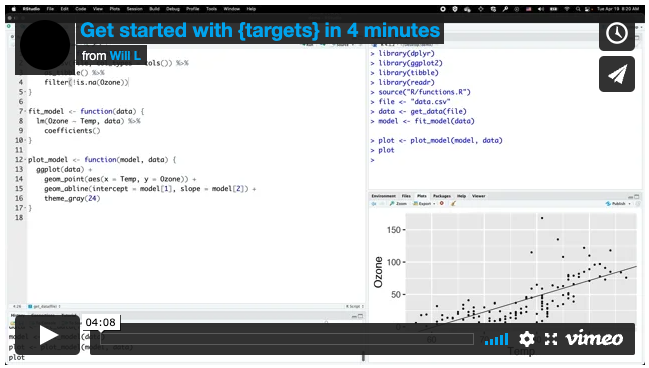

# Get started with `targets` in 4 minutes

The [`targets`](https://docs.ropensci.org/targets/) R package is a pipeline tool for reproducible computation in statistics and data science. This short example is the one from the 4-minute video on getting started with [`targets`](https://docs.ropensci.org/targets/):

## Get started in 4 minutes

The following 4-minute video demonstrates the example pipeline used in
the [walkthrough](https://books.ropensci.org/targets/walkthrough.html)
and [functions](https://books.ropensci.org/targets/functions.html)
chapters of the [user manual](https://books.ropensci.org/targets/).

## Try it out

Visit 

## Files

* `data.csv`: the `airquality` dataset from the `datasets` package.
* `R/functions.R`: custom R functions you define for the analysis.
* `_targets.R`: a special script to configure and define the pipeline.

## Usage

1. `install.packages("targets")` to install the package.
1. [`tar_manifest()`](https://docs.ropensci.org/targets/reference/tar_manifest.html) and [`tar_visnetwork()`](https://docs.ropensci.org/targets/reference/tar_visnetwork.html) to check the pipeline for correctness.
1. [`tar_make()`](https://docs.ropensci.org/targets/reference/tar_make.html) or [similar](https://docs.ropensci.org/targets/reference/index.html#pipeline) to run the pipeline.
1. [`tar_read()`](https://docs.ropensci.org/targets/reference/tar_read.html) to read target output.

## Changes

* Rerun [`tar_make()`](https://docs.ropensci.org/targets/reference/tar_make.html) after changing nothing else. All targets will be skipped.
* Change the contents of `data.csv` and then rerun [`tar_make()`](https://docs.ropensci.org/targets/reference/tar_make.html). All the targets will rerun.
* Change only the `plot_model()` function in `R/function.R` and then rerun [`tar_make()`](https://docs.ropensci.org/targets/reference/tar_make.html). Only the `plot` target will rerun, and the rest will be skipped.
